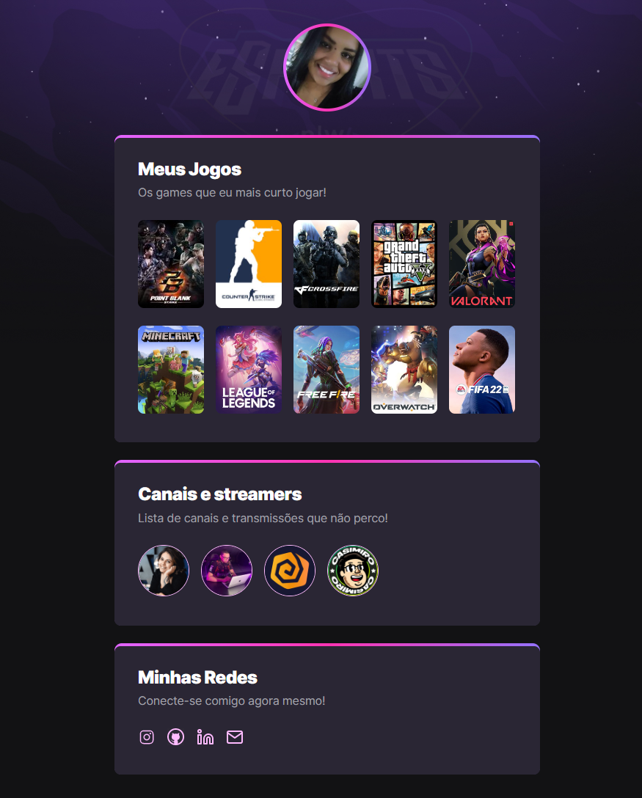

# NLW eSports 

> Trilha Explorer

Projeto desenvolvido durante o evento "Next Level Week" da Rocketseat.

[🔗 Clique aqui para acessá-lo](https://priscilamv.github.io/nlw-esports-explorer)

## 🚀 Tecnologias

- HTML
- CSS
- Git e Github

## 🔖Layout

Clique [aqui](https://www.figma.com/file/Mq5CvBuJ0pZAB1GodUiuxk/NLW-eSports-(Community)?node-id=79%3A2502)
para visualizar o layout do projeto.

- Para ter acesso ao  layout, é necessário ter uma conta no [Figma](https://www.figma.com/) !
 
